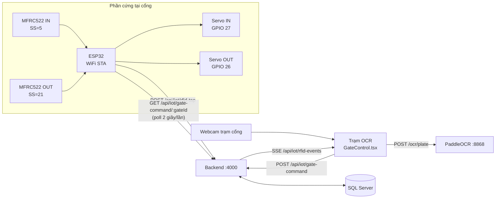
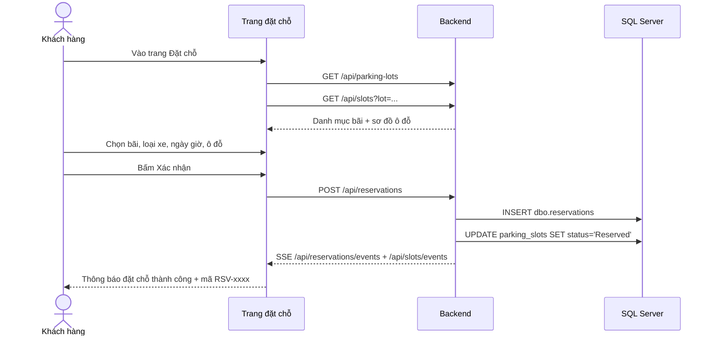
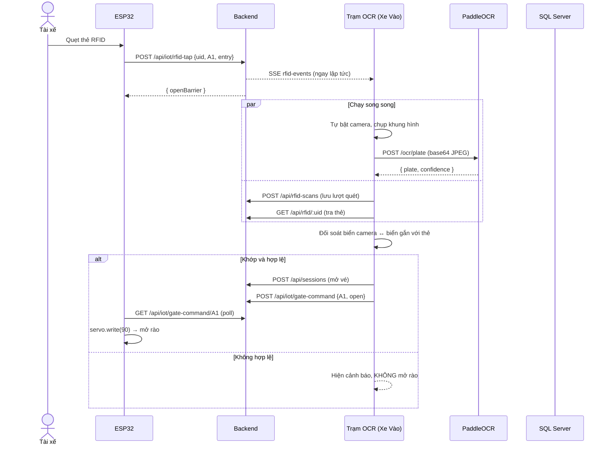
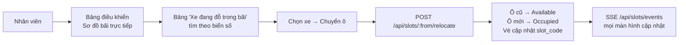
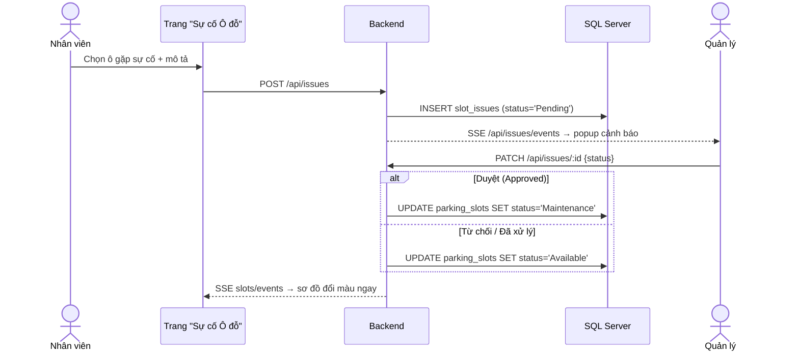
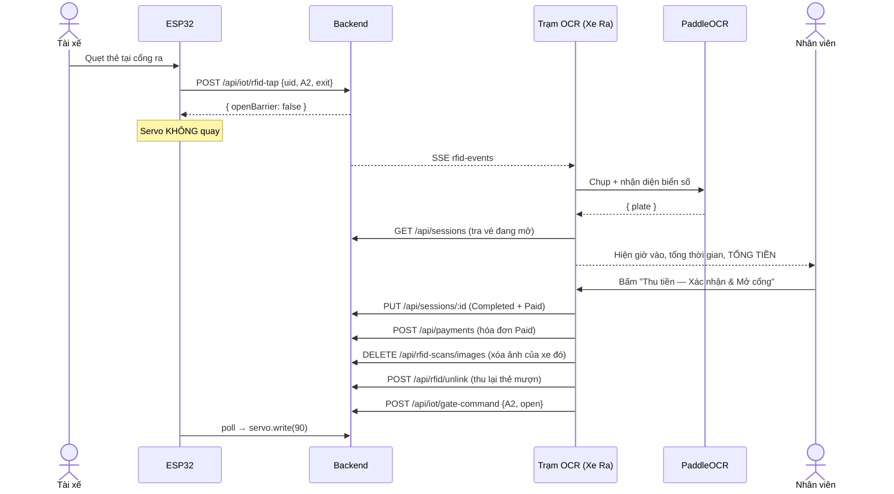

# ParkFlow — 5 luồng nghiệp vụ chính (kèm lớp IoT)

Tài liệu mô tả chi tiết 5 kịch bản trong phần **VI. Workflow Demonstration**, đối chiếu
với mã nguồn đang chạy: giao diện nào, gọi API nào, ghi bảng nào trong SQL Server, và
phần cứng ESP32 tham gia ở đâu.

> Mỗi mục có 3 phần: **Sơ đồ** → **Các bước chi tiết** → **Ràng buộc & lỗi đã xử lý**.
> Phần "Ràng buộc" là những trường hợp thực tế đã gây lỗi và đã được chặn trong code —
> đây mới là phần đáng nói khi demo, vì nó cho thấy hệ thống xử lý được tình huống xấu.

---

## 0. Kiến trúc & lớp IoT

### 0.1 Các thành phần

| Thành phần | Công nghệ | Vai trò |
|---|---|---|
| Frontend | Vite 6 + React 19 + TypeScript + Tailwind | Giao diện 4 vai trò: Tài xế, Nhân viên, Quản lý, Quản trị |
| Backend | Node.js + Express + `mssql` | REST API + SSE (server-sent events) |
| CSDL | SQL Server (`parking_management`) | Nguồn chân lý duy nhất |
| OCR | PaddleOCR 3.7 + FastAPI (cổng **8868**) | Nhận diện biển số từ khung hình webcam |
| IoT | ESP32 + 2× MFRC522 (RFID) + 2× servo | Đọc thẻ tại cổng, nâng/hạ barie |
| Đường truyền ngoài | ngrok HTTPS → Vite 5173 | Cho phép truy cập từ máy khác / điện thoại |

### 0.2 Sơ đồ tổng thể



### 0.3 Hai chiều giao tiếp với ESP32

Đây là điểm hay bị hiểu nhầm nhất — ESP32 **không** mở được cổng theo ý mình:

**Chiều lên (thiết bị → hệ thống):** quẹt thẻ

```
Thẻ chạm đầu đọc
  → ESP32 đọc UID (vd. "27E63325")
  → POST /api/iot/rfid-tap { rfidUid, gateId, direction }
  → Backend phát SSE cho mọi trạm cổng đang mở
  → Backend trả về { openBarrier: true|false }
```

**Chiều xuống (hệ thống → thiết bị):** lệnh mở/đóng rào

```
Nhân viên bấm nút / hệ thống quyết định cho xe qua
  → POST /api/iot/gate-command { gateId, command }
  → Backend xếp vào hàng đợi (Map trong RAM)
  → ESP32 poll GET /api/iot/gate-command/:gateId mỗi 2 giây
  → Đọc xong thì lệnh bị xóa khỏi hàng đợi (chỉ thực thi 1 lần)
  → servo.write(90) → tự đóng sau 5 giây
```

**Quy tắc `openBarrier`** (`server.js` — `/api/iot/rfid-tap`):

```js
openBarrier = evt.direction === 'entry';   // chỉ khi thẻ ĐÃ đăng ký
```

→ **Cổng RA không bao giờ tự mở khi quẹt thẻ.** Xe chỉ ra được sau khi nhân viên
bấm "Thu tiền — Xác nhận & Mở cổng", vì tiền phải thu trước khi barie nâng.

### 0.4 Badge "IoT: Trực tuyến / Ngoại tuyến"

```js
esp32Online = Date.now() - lastEsp32SeenMs < 10000
```

`lastEsp32SeenMs` được cập nhật khi ESP32 gọi `/api/iot/rfid-tap` **hoặc**
`/api/iot/gate-command/:gateId`. Do ESP32 poll mỗi 2 giây, badge xanh nghĩa là
thiết bị đã liên lạc trong 10 giây gần nhất.

> ⚠️ Bất kỳ client nào gọi `/api/iot/gate-command/:gateId` cũng làm badge xanh.
> Mở URL đó bằng trình duyệt để "kiểm tra" sẽ cho tín hiệu giả trong 10 giây.

### 0.5 Ghi chú phần cứng

| Chân | Chức năng | Ghi chú |
|---|---|---|
| GPIO 22 | RST **dùng chung** cả 2 đầu đọc | Xem lỗi bên dưới |
| GPIO 5 / 21 | SS đầu đọc IN / OUT | Kéo HIGH cả hai trước khi init |
| GPIO 27 / 26 | Servo IN / OUT | 50 Hz, mở = 90°, đóng = 0° |

**Lỗi kinh điển đã xử lý:** hai đầu đọc dùng chung chân RST. Khi `rfidOut.PCD_Init()`
chạy, nó kéo RST xuống và **reset luôn `rfidIn`, tắt ăng-ten của nó**. Chip vẫn sống
nên vẫn đọc ra version `0x92` "OK", nhưng không bao giờ bắt được thẻ. Cách sửa: bật
lại ăng-ten cho **cả hai** sau khi đã init xong cả hai.

```cpp
rfidIn.PCD_Init();  delay(50);
rfidOut.PCD_Init(); delay(50);
rfidIn.PCD_AntennaOn();    // BẮT BUỘC — không có 2 dòng này thì đầu IN chết câm
rfidOut.PCD_AntennaOn();
```

Hàm `ensureRc522Alive()` chạy mỗi 5 giây kiểm tra cả **version** lẫn **trạng thái
ăng-ten** — đọc được version không có nghĩa ăng-ten đang bật, đó là hai việc khác nhau.

---

## Scenario #1 — Đặt chỗ (Parking Spot Reservation)

**Vai trò:** Khách hàng (Tài xế) · **Trang:** `AvailableSlots.tsx`

### Sơ đồ



### Các bước chi tiết

| # | Hành động | Kỹ thuật |
|---|---|---|
| 1 | Vào trang đặt chỗ | `GET /api/parking-lots` lấy danh mục bãi (tên, địa chỉ, trạng thái) |
| 2 | Chọn bãi | `GET /api/slots?lot=<tên bãi>` — mỗi bãi có kho ô riêng, mã ô mang tiền tố (`LP-F1-A01`, `TD-F1-A01`) để UNIQUE toàn cục |
| 3 | Xem sơ đồ | `ParkingFloorMap.tsx` vẽ ô theo `posX/posY` Admin đã kéo thả; kích thước ô theo **loại xe** (xe máy nhỏ nhất → ô tô xăng vừa → ô tô điện lớn nhất) |
| 4 | Điền form | Loại xe, biển số, ngày, giờ vào/ra, gói (theo lượt / qua đêm / theo tháng) |
| 5 | Xác nhận | `POST /api/reservations` |
| 6 | Hệ thống báo thành công | Sinh mã `RSV-xxxx`; ô chuyển `Available → Reserved`; đẩy SSE cho mọi màn hình đang mở |

### Ràng buộc & lỗi đã xử lý

- **Bãi chỉ có 1 tầng.** Backend luôn ghi đè `floor = 'Tầng 1'`, bỏ qua giá trị client
  gửi lên. Trước đây client cũ gửi `"Floor 1"` / `"Basement B1"` / `"2"` khiến lịch
  sử của một khách bị phân tán ra nhiều tầng không có thật.
- **Đặt ô D01 nhưng hệ thống xếp vào A01.** Đã sửa: khi chọn ô thủ công thì
  `slotAssignmentMode = 'Manual'` và `slot_code` được tôn trọng nguyên vẹn.
- **Bãi đang Bảo trì / Đóng cửa** không cho đặt (`isLotUnavailable`).
- **Chọn ô đồng thời:** backend dùng `UPDLOCK/HOLDLOCK/READPAST` khi cấp ô để hai
  người bấm cùng lúc không nhận trùng một ô.

---

## Scenario #2 — Xe vào bãi (Vehicle Check-in)

**Vai trò:** Nhân viên · **Trang:** `GateControl.tsx` (Trạm OCR — Xe Vào, cổng A1)

### Sơ đồ



### Các bước chi tiết

**Bước 1 — Quẹt thẻ.** ESP32 đọc UID, chống dội 3 giây (cùng thẻ quẹt lại trong
3 giây thì bỏ qua), gửi lên backend. Backend **phát SSE trước, tra CSDL sau** — camera
bắt đầu chụp song song thay vì đợi thêm một lượt truy vấn.

**Bước 2 — Camera + OCR.** Trạm tự bật webcam, chụp `canvas.toDataURL('image/jpeg', 0.92)`,
gửi base64 sang PaddleOCR. Ảnh được thu nhỏ về cạnh dài ≤ 1280px trước khi suy luận
(nhanh hơn và ổn định hơn trên CPU). Ảnh lưu vào `dbo.rfid_scans.image_data`.

**Bước 3 — Tra thẻ.** `GET /api/rfid/:uid` trả hồ sơ xe + chủ xe nếu thẻ đã liên kết.

**Bước 4 — Đối soát và quyết định:**

| Tình huống | Xử lý |
|---|---|
| Thẻ đã liên kết, biển camera **khớp** biển trên thẻ | Mở vé + mở rào |
| Thẻ đã liên kết, biển camera **khác** biển trên thẻ | ❌ Không mở rào — cảnh báo có thể đưa nhầm thẻ |
| **Chưa đọc được biển số** | ❌ Không mở rào — chờ camera, nút "Chụp & OCR" để quét lại |
| Xe **đã ở trong bãi** | ❌ Không mở rào — banner đỏ báo vị trí ô và giờ vào |
| Biển số là **xe thẻ tháng** | ❌ Không mở rào — yêu cầu quét mã QR thẻ tháng |
| Thẻ trắng + biển khớp đơn đặt chỗ | Tự liên kết thẻ ↔ xe, check-in, mở rào |
| Thẻ trắng + biển hợp lệ, không có đặt chỗ | Hộp thoại **khách vãng lai**: chọn loại xe → rồi mới mở rào |

**Bước 5 — Mở vé.** `POST /api/sessions` sinh mã vé `TK-xxxxxx`, gán ô đỗ, ô chuyển
`Occupied`.

**Bước 6 — Mở rào.** Đẩy lệnh vào hàng đợi; ESP32 poll và quay servo; tự đóng sau 5 giây.

### Ràng buộc & lỗi đã xử lý

- **Không tự mở rào khi chưa đọc được biển số.** Trước đây quẹt thẻ là mở cổng bất kể
  camera đọc được hay không — thẻ đưa nhầm xe vẫn lọt qua mà không ai đối soát được.
- **Mở rào SAU khi chọn loại xe** với khách vãng lai. Loại xe quyết định cỡ ô và bảng
  giá; mở rào trước rồi mới hỏi thì xe đã lăn vào bãi mà hệ thống chưa biết xếp đâu.
- **Chặn vào 2 lần.** Kiểm tra vé đang mở **trước** khi mở rào và **trước** khi ghi
  nhật ký. Trước đây thứ tự ngược lại nên mỗi lần quẹt lại là rào mở cho một chiếc xe
  đang đỗ, và sổ ghi thêm một lượt vào không có thật.
- **Bãi chưa có ô cho loại xe đó** vẫn mở vé với `slot_code` rỗng — xe vẫn được tính là
  đang trong bãi. Khi Quản lý thêm ô, `assignPendingSessions()` tự xếp ô cho các vé này.
- **Xe tháng không được vào bằng RFID** — phải quét QR để giữ đúng ô đã đăng ký và
  kiểm tra hạn thẻ.

---

## Scenario #3 — Kiểm tra & cập nhật ô đỗ (Parking Spot Verification and Update)

**Vai trò:** Nhân viên · **Trang:** Bảng điều khiển → panel sơ đồ bãi

### Sơ đồ



### Các bước chi tiết

1. **Mở sơ đồ trực tiếp.** Vẽ đúng bãi nhân viên phụ trách, màu theo trạng thái:
   `Available` / `Occupied` / `Reserved` / `Locked` (giữ chỗ tháng) / `Maintenance`.
2. **Tra cứu xe.** Bảng "Xe đang đỗ trong bãi" gộp từ **hai** nguồn: `reservations`
   trạng thái `Checked-in` **và** `parking_sessions` đang `Active` (khách vãng lai
   không có đặt chỗ). Tìm biển số bỏ qua dấu gạch/chấm: gõ `29C138383` ra `29C1-383.83`.
3. **So khớp thực tế.** Nhân viên đi kiểm tra xem xe có đúng ô hệ thống ghi không.
4. **Chuyển ô.** Chọn xe → chọn ô đích → `POST /api/slots/:fromSlotCode/relocate`.
   Danh sách ô đích chỉ hiện ô **đang trống và đúng loại xe**.
5. **Cập nhật trạng thái.** Backend làm trong một transaction: trả ô cũ, chiếm ô mới,
   sửa `slot_code` của vé, rồi phát SSE.

### Ràng buộc & lỗi đã xử lý

- **Xe chưa được xếp ô vẫn phải hiện.** Bộ lọc cũ đòi `slot_code` khác rỗng nên xe vào
  lúc bãi hết ô phù hợp biến mất khỏi bảng — nhân viên thấy xe đứng trong bãi mà hệ
  thống thì không.
- **Chống trùng ô.** Một xe đặt trước sau khi vào bãi có **cả hai** bản ghi (reservation
  + session) cùng `slot_code`; bảng loại trùng theo mã ô.
- **Ô thẻ tháng giữ trạng thái `Locked`**, không trả về `Available` khi xe ra — ô đó vẫn
  thuộc về khách suốt tháng.
- **Panel xe tháng** liệt kê từng ô tháng: biển số, chủ xe, mã đăng ký, ngày hết hạn,
  đếm ngược (đỏ khi ≤ 7 ngày), và cảnh báo nếu ô rơi khỏi trạng thái `Locked`/`Occupied`
  trong khi thẻ còn hạn.

---

## Scenario #4 — Giám sát & xử lý sự cố (Parking Monitoring and Incident Management)

**Vai trò:** Nhân viên báo → Quản lý duyệt · **Trang:** `EmergencyReport.tsx` → `ManagerExceptions.tsx`

### Sơ đồ



### Các bước chi tiết

| # | Bước | Kỹ thuật |
|---|---|---|
| 1 | Nhân viên vào trang **Sự cố Ô đỗ** | Chỉ thấy ô của bãi mình phụ trách |
| 2 | Chọn ô trên sơ đồ + mô tả sự cố | Ví dụ: vạch kẻ mờ, đèn hỏng, nền nứt, xe đỗ chèn |
| 3 | Gửi lên Quản lý | `POST /api/issues` → `slot_issues` với `status='Pending'` |
| 4 | Quản lý nhận thông báo | SSE `/api/issues/events` → popup hiện ngay, badge đếm trên menu **Xử lý Ngoại lệ** |
| 5 | Quản lý quyết định | `PATCH /api/issues/:id` |
| 6 | Hệ thống cập nhật ô | `Approved` → ô thành `Maintenance` (không nhận xe); `Rejected`/`Resolved` → về `Available` |

**Thẻ "Ô đỗ đang bảo trì"** trên bảng điều khiển nhân viên đếm **chỉ** số ô
`Maintenance`. Trước đây còn cộng thêm số lượt quét thẻ bị từ chối — hai thứ khác hẳn
nhau (ô hỏng là hạ tầng cần đi sửa, quét thẻ trượt là việc thường ngày ở cổng), gộp lại
làm con số phồng lên và nhân viên không biết phải đi xử lý cái gì.

### Ràng buộc & lỗi đã xử lý

- **Nhân viên không tự đặt ô về `Maintenance`.** Phải qua Quản lý duyệt — nếu không thì
  ô có thể bị khóa tùy tiện và không lần ra được nguồn gốc.
- **Cô lập theo bãi.** Nhân viên chỉ báo được sự cố của bãi mình được phân công.
- **Bãi đang bảo trì** khóa toàn bộ thao tác vận hành của nhân viên tại một điểm duy
  nhất (`guardMaintenance()`) thay vì rải rác từng nút bấm, để không sót.

---

## Scenario #5 — Xe ra bãi (Vehicle Check-out)

**Vai trò:** Nhân viên · **Trang:** `GateControl.tsx` (Trạm OCR — Xe Ra, cổng A2)

### Sơ đồ



### Các bước chi tiết

1. **Quẹt thẻ.** ESP32 gửi tap với `direction='exit'` → backend trả `openBarrier=false`.
   **Servo không quay.** Đây là điểm khác biệt cốt lõi so với cổng vào.
2. **Nhận diện biển số.** Camera chụp + OCR. Màn hình hiện **biển camera đọc được**,
   không phải biển ghi trên thẻ — để nhân viên đối soát bằng mắt.
3. **Tra vé.** Tìm `parking_sessions` đang `Active` theo biển số → giờ vào, tổng thời
   gian, tổng tiền (giá gói + phụ phí quá giờ − phần đã trả trước).
4. **Nhân viên xác nhận thu tiền.** Đây là **nơi duy nhất** cổng ra được mở.
5. **Đóng vé.** `PUT /api/sessions/:id` → `Completed` + `Paid`; ô trả về `Available`
   (hoặc giữ `Locked` nếu là ô thẻ tháng); ghi hóa đơn `Paid`.
6. **Dọn dữ liệu thẻ.** Xóa ảnh biển số đã lưu của **đúng xe vừa ra**, và gỡ liên kết
   thẻ mượn để phát lại cho xe khác.
7. **Mở rào.** Lệnh vào hàng đợi → ESP32 thực thi.

### Nút "Thu tiền & Mở cổng" bị khóa xám khi nào

Tất cả tính **ngay lúc render**, không đợi nhân viên bấm rồi mới báo lỗi — vì với tiền
mặt thì bấm xong là đã nhận tiền của khách.

| Lý do khóa | Thông báo |
|---|---|
| Xe là **thẻ tháng** | Phải cho ra bằng mã QR, không thu tiền |
| **Sai bãi** — xe vào bãi A mà ra ở bãi B | Chỉ ra được tại chính bãi đã vào |
| **Thẻ khác biển ban đầu** | Camera đọc ra biển khác biển gắn với thẻ |
| **Không có vé đang mở** | Xe đã ra rồi hoặc chưa từng vào |

### Ràng buộc & lỗi đã xử lý

- **Đóng vé TRƯỚC, ghi nhật ký SAU.** Trước đây nhật ký ghi "RA — Thành công" ngay dòng
  đầu, bất kể vé có đóng được hay không; xe bị server từ chối vẫn để lại một dòng ra
  thành công giả trong sổ.
- **Chờ server trả lời rồi mới coi là đã cho ra.** Lệnh cũ chạy kiểu "bắn rồi quên" nên
  dù server từ chối (403 sai bãi / 409 đã ra rồi) thì cổng vẫn mở.
- **Khóa nút bám vào dữ liệu, không bám vào banner cảnh báo.** Banner có nút "Đóng";
  nếu khóa dựa vào banner thì nhân viên tắt thông báo là thu được tiền của khách tháng.
- **Xe tháng ra bãi giữ nguyên cả thẻ lẫn ô** tới hết hạn. Trước đây trả ô về
  `Available` và gỡ luôn thẻ — sau lần ra đầu tiên là khách mất trắng cả ô lẫn thẻ.
- **Ô đi mượn thì trả lại cho bãi.** Chỉ **đúng ô đã đăng ký** trên thẻ tháng mới giữ
  `Locked`; khách tháng vào bãi diện vãng lai mượn tạm ô khác thì ô đó phải trả về.

---

## Phụ lục A — Bảng dữ liệu chính

| Bảng | Vai trò |
|---|---|
| `parking_lots` | Danh mục bãi (tên, địa chỉ, trạng thái) |
| `parking_slots` | Ô đỗ: `slot_code`, `parking_lot`, `vehicle_type`, `status`, toạ độ sơ đồ |
| `reservations` | Đặt chỗ; `note='Theo tháng'` đánh dấu thẻ tháng |
| `parking_sessions` | Vé gửi xe: `ticket_code`, giờ vào/ra, `parking_lot`, `session_status` |
| `payments` | Hóa đơn; nối về bãi qua `reservation_code` hoặc `ticket_code` |
| `vehicles` | Hồ sơ xe + `rfid_uid`; UNIQUE trên **(biển số, loại xe)** |
| `rfid_scans` | Nhật ký quét thẻ thô + ảnh biển số (base64) |
| `access_logs` | Nhật ký qua cổng, có cột `parking_lot` |
| `slot_issues` | Sự cố ô đỗ (Scenario #4) |

## Phụ lục B — API theo kịch bản

| Kịch bản | Endpoint chính |
|---|---|
| #1 Đặt chỗ | `GET /api/parking-lots`, `GET /api/slots`, `POST /api/reservations` |
| #2 Xe vào | `POST /api/iot/rfid-tap`, `GET /api/iot/rfid-events` (SSE), `POST /ocr/plate`, `POST /api/rfid-scans`, `GET /api/rfid/:uid`, `POST /api/sessions`, `POST /api/iot/gate-command` |
| #3 Kiểm tra ô | `GET /api/slots`, `GET /api/sessions`, `POST /api/slots/:code/relocate`, `PATCH /api/slots/:code` |
| #4 Sự cố | `POST /api/issues`, `GET /api/issues/events` (SSE), `PATCH /api/issues/:id` |
| #5 Xe ra | `GET /api/sessions`, `PUT /api/sessions/:id`, `POST /api/payments`, `DELETE /api/rfid-scans/images`, `POST /api/rfid/unlink`, `POST /api/iot/gate-command` |

## Phụ lục C — Cấu hình ESP32 khi demo

```cpp
const char* WIFI_SSID = "<tên WiFi 2.4GHz>";
const char* WIFI_PASS = "<mật khẩu>";
const char* BACKEND   = "http://<IP LAN của máy chạy backend>:4000";
const char* GATE_ID_IN  = "A1";   // khớp initialGates trên web
const char* GATE_ID_OUT = "A2";
```

**Ba lỗi hay gặp nhất khi demo:**

1. **Sai IP backend.** `BACKEND` phải là IP **LAN** của máy chạy backend (xem `ipconfig`,
   dòng adapter Wi-Fi), cùng dải với IP mà ESP32 in ra Serial. Đây là IP DHCP — đổi
   mạng hoặc tắt/bật Wi-Fi là đổi, phải nạp lại sketch.
2. **ESP32 chỉ bắt được WiFi 2.4GHz.** Router phát 5GHz thì không vào được.
   WiFi quán/trường có trang đăng nhập (captive portal) cũng không dùng được.
3. **RC522 không phản hồi (`0x00`).** Lỗi phần cứng, không phải phần mềm. Kiểm tra dây
   `SS`, `RST`, `GND`, và **nguồn 3.3V — cắm 5V sẽ làm chết chip**.

`pollGateCommand()` nên in log khi thất bại; nếu không, ESP32 gọi hụt mỗi 2 giây mà
Serial vẫn sạch bong, rất khó lần ra nguyên nhân badge "Ngoại tuyến".
